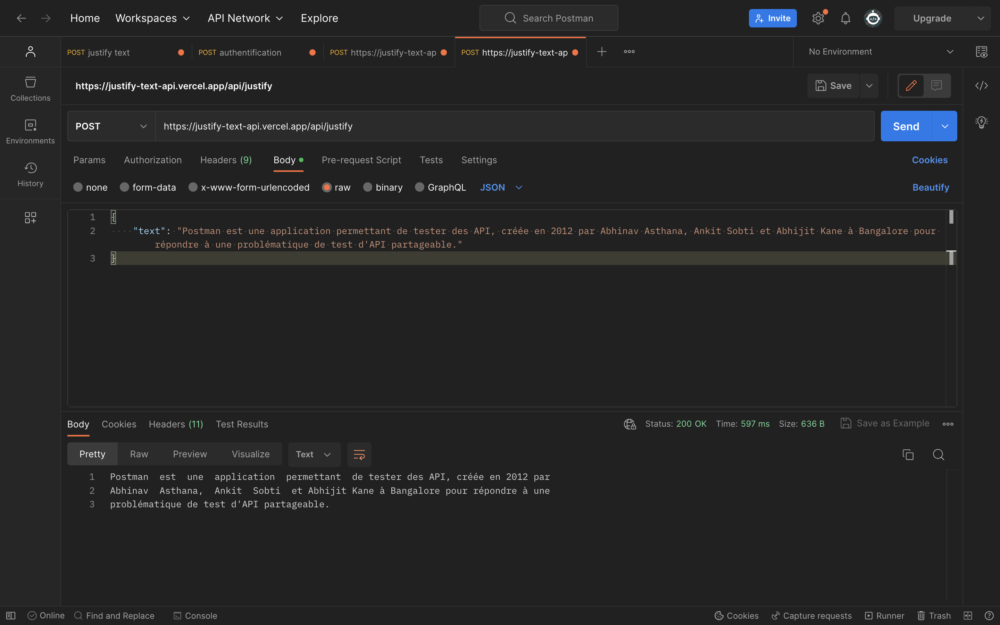
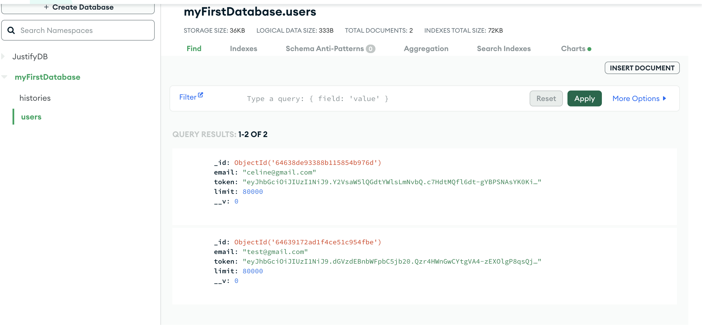

# API_Justify_Text

Ce projet est une API REST développée en Node.js et TypeScript pour la startup Tictactrip. L'API permet de justifier un texte avec une largeur de ligne de 80 caractères. L'utilisateur doit fournir son adresse e-mail pour s'authentifier et accéder à l'API, avec une limite quotidienne de 80 000 mots.

## Technologies utilisées

* Node.js
* TypeScript
* Express
* Jest
* Mongoose
* Jsonwebtoken

## Installation

Clonez le dépôt GitHub.
Installez les dépendances : npm install.
Lancez le serveur : npm run dev.

## Utilisation

L'API peut être utilisée via deux endpoints :

Endpoint /api/token (méthode HTTP POST) : Les données doivent être envoyées sous forme de JSON avec la clé "email" contenant l'adresse e-mail utilisée pour l'authentification. Cette adresse e-mail sera enregistrée dans la base de données, et un jeton (token) sera créé et renvoyé en réponse.

Endpoint /api/justify (méthode HTTP POST) : Les données doivent être envoyées sous forme de JSON avec la clé "text" contenant le texte à justifier. Il est également nécessaire d'inclure l'en-tête "Authorization" avec pour valeur "Bearer" suivi d'un espace, puis du jeton (token) obtenu lors de l'authentification. Si aucun compte n'existe avec l'adresse e-mail fournie, ou si le jeton fourni n'est pas valide, une erreur sera renvoyée demandant de s'authentifier. Si l'authentification réussit et que la limite quotidienne de mots (80 000) n'est pas dépassée, le texte sera renvoyé justifié. Dans le cas contraire, une erreur 402 sera renvoyée.

## Simulation d'utilisation

Afin de tester et utiliser les routes, vous pouvez utiliser l'application Postman.

Effectuez une requête vers l'endpoint /api/token avec la méthode POST, en ajoutant dans le corps (body) de la requête un champ "email" contenant votre adresse e-mail. Appuyez sur "Send" pour recevoir votre jeton d'authentification (token). Cela vous enregistrera dans la base de données.

Effectuez ensuite une requête vers l'endpoint /api/justify avec la méthode POST pour recevoir votre texte justifié. Ajoutez votre jeton d'authentification (token) dans le header en utilisant l'en-tête 'Authorization' avec la valeur 'Bearer (token)'.

Dans le corps (body) de la requête, utilisez le format JSON avec la clé "text" contenant le texte que vous souhaitez justifier. Appuyez sur "Send". Si toutes les conditions sont respectées, vous recevrez votre texte justifié.

Vous pouvez vérifier si vous êtes bien enregistré dans la base de données et si votre historique est à jour.

## Tests

Les tests unitaires sont réalisés avec le framework Jest. Pour exécuter les tests, utilisez la commande npm test. Les tests sont effectués pour le fichier justifyController.ts

## Contact

Pour toute question ou problème, n'hésitez pas à me contacter par e-mail : [manonleba@icloud.com].